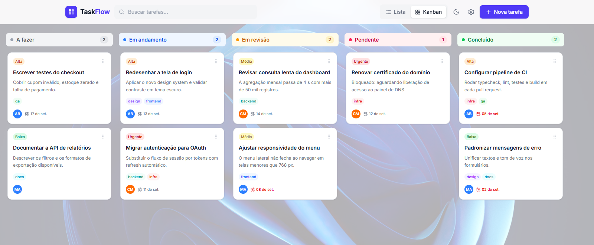
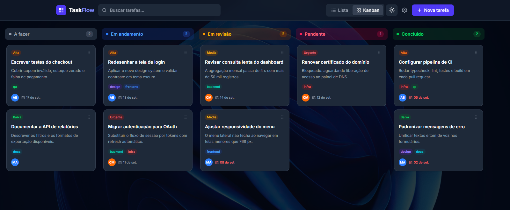
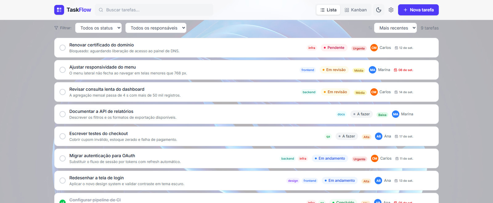
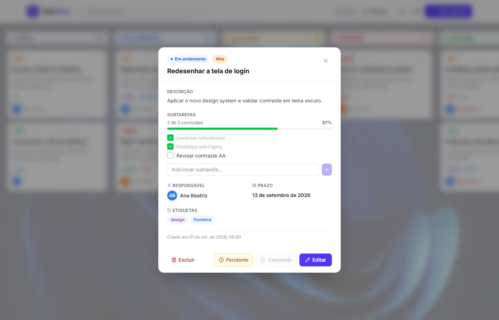
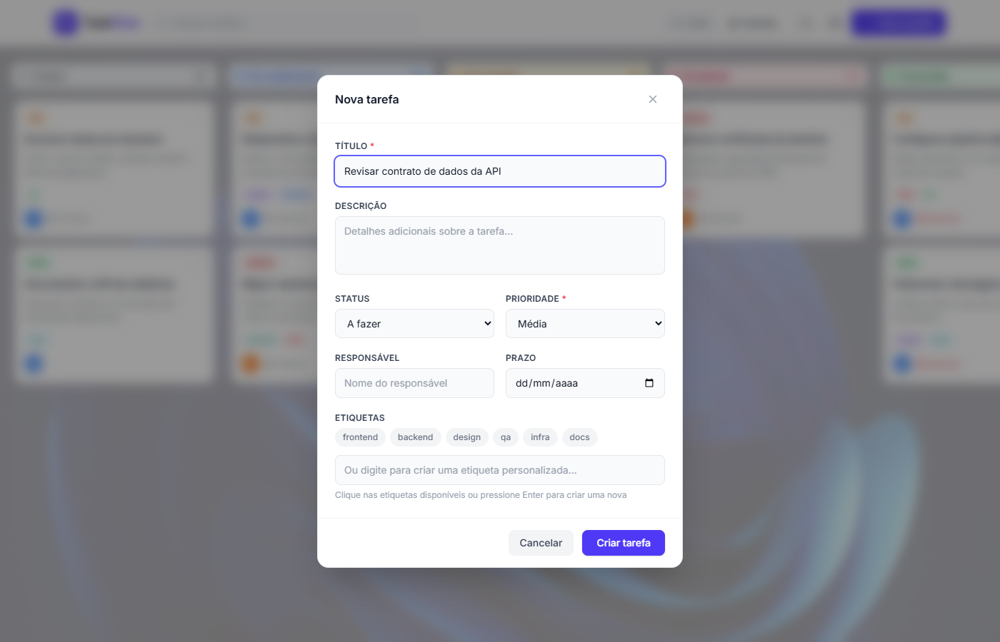
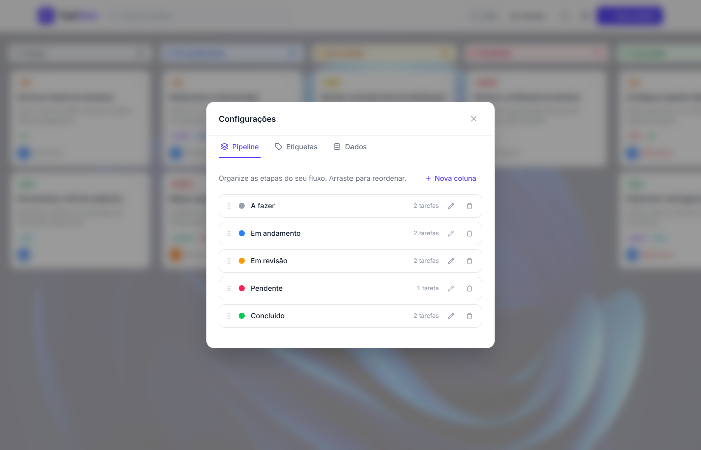
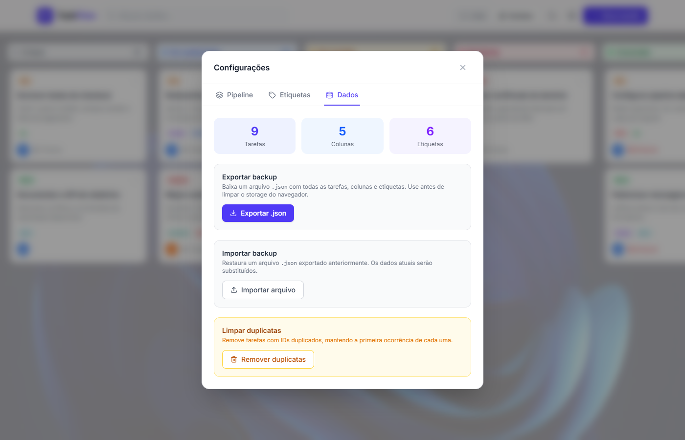

# 📋 TaskFlow — Sistema de Gerenciamento de Tarefas

> Aplicação web para organização de tarefas com visualização em lista e quadro Kanban, desenvolvida com React 19, TypeScript e animações com Framer Motion.



---

## Sumário

- [Visão geral](#-visão-geral)
- [Funcionalidades](#-funcionalidades)
- [Telas](#-telas)
- [Instalação](#-instalação)
- [Como usar](#-como-usar)
- [Scripts disponíveis](#-scripts-disponíveis)
- [Testes e qualidade](#-testes-e-qualidade)
- [Tecnologias](#-tecnologias)
- [Estrutura do projeto](#-estrutura-do-projeto)
- [Persistência de dados](#-persistência-de-dados)
- [Solução de problemas](#-solução-de-problemas)

---

## 🖼️ Visão Geral

O **TaskFlow** é um sistema de gerenciamento de tarefas para quem quer controle visual do fluxo de trabalho. Dá para criar tarefas detalhadas, acompanhar o progresso por colunas personalizáveis no Kanban e registrar soluções e motivos de pendência direto na tarefa.

Todos os dados ficam no próprio navegador — **sem servidor, sem banco de dados, sem cadastro**. Abrir o `index.html` da build já é o suficiente.

---

## ✨ Funcionalidades

- **Duas visualizações** — Lista e Kanban, com troca animada entre elas
- **Kanban com drag and drop** — arraste tarefas entre colunas e reordene dentro da coluna
- **Colunas personalizáveis** — crie, renomeie, reordene e exclua colunas, com 8 cores disponíveis
- **Tarefas completas** — título, descrição, responsável, prazo, prioridade e etiquetas
- **Subtarefas** — checklist interno por tarefa, com barra de progresso
- **Registro de conclusão** — descreva a solução e a data ao concluir
- **Registro de pendência** — informe o motivo ao marcar como pendente
- **Busca global** — por título, descrição, responsável ou etiqueta, nas duas visualizações
- **Filtros e ordenação** — filtre por status e responsável; ordene por prioridade, prazo ou data
- **Etiquetas coloridas** — paleta de 10 cores, configurável; renomear uma etiqueta atualiza todas as tarefas
- **Tema claro e escuro** — segue a preferência do sistema na primeira visita e depois memoriza a sua escolha
- **Exportar / Importar** — backup completo em `.json` para migrar ou restaurar
- **Responsivo** — verificado de 320 px a 1600 px, sem transbordo horizontal
- **Acessível por teclado** — `Esc` fecha qualquer diálogo, `Tab` fica preso dentro do modal aberto, e o foco volta para onde estava ao fechar

---

## 📸 Telas

### Quadro Kanban — tema claro e escuro

As colunas entram em cascata ao carregar. O contador de cada coluna anima quando muda, e a zona de soltar destaca durante o arraste.




### Visualização em lista

Mais densa, com filtros de status e responsável, ordenação e contagem de resultados. Colunas de informação aparecem progressivamente conforme a largura da tela permite.



### Detalhe da tarefa

Mostra descrição, subtarefas com progresso, responsável, prazo e etiquetas. O botão **Concluído** fica desabilitado enquanto houver subtarefa pendente — no exemplo abaixo, falta uma das três.



### Criar e editar tarefa

Campos aparecem em cascata ao abrir. O título é obrigatório; as etiquetas podem ser escolhidas entre as existentes ou criadas na hora digitando e pressionando `Enter`.



### Configurações — pipeline e etiquetas

Crie, renomeie, recolora, reordene e exclua colunas e etiquetas. Excluir uma coluna move as tarefas dela para outra em vez de perdê-las.



### Configurações — dados

Exportar gera um `.json` com tarefas, colunas e etiquetas. Importar valida o arquivo antes de aplicar e pede confirmação, porque substitui os dados atuais.



### Mobile

A busca ganha uma linha própria, o quadro rola horizontalmente e as ações de editar e excluir ficam sempre visíveis — em tela de toque não existe `hover` para revelá-las.

<p align="center">
  
</p>

---

## 🚀 Instalação

### Pré-requisitos

| Requisito | Versão mínima | Como verificar |
|---|---|---|
| [Node.js](https://nodejs.org/) | 20 | `node -v` |
| npm | 10 (vem com o Node) | `npm -v` |

> **Windows:** se o PowerShell recusar a execução de scripts do npm, rode uma vez, como administrador:
> ```powershell
> Set-ExecutionPolicy RemoteSigned -Scope CurrentUser
> ```

### Passo a passo

**1. Clone o repositório**

```bash
git clone https://github.com/seu-usuario/taskflow.git
```

**2. Entre na pasta**

```bash
cd taskflow
```

**3. Instale as dependências**

```bash
npm install
```

Na primeira vez o download leva alguns minutos.

**4. Inicie o servidor de desenvolvimento**

```bash
npm run dev
```

**5. Abra no navegador**

```
http://localhost:5173
```

O servidor fica ativo enquanto o terminal estiver aberto; `Ctrl + C` encerra. As alterações no código recarregam a página automaticamente.

### Gerar a versão de produção

```bash
npm run build     # gera a pasta dist/
npm run preview   # serve a dist/ em http://localhost:4173
```

A pasta `dist/` é estática — pode ser publicada em qualquer hospedagem de arquivos (GitHub Pages, Netlify, Vercel, um bucket S3 ou até um servidor Apache/Nginx comum).

---

## 📖 Como usar

Na primeira abertura o TaskFlow já vem com tarefas de exemplo, para você não encarar uma tela vazia. Pode apagá-las à vontade.

### Criar uma tarefa

1. Clique em **Nova tarefa** no canto superior direito.
2. Preencha o **título** — é o único campo obrigatório.
3. Opcionalmente defina descrição, status inicial, prioridade, responsável e prazo.
4. Escolha etiquetas clicando nos chips, ou digite uma nova e pressione `Enter`.
5. Clique em **Criar tarefa**.

### Mover tarefas no Kanban

- **Arraste o card** para outra coluna para mudar o status.
- **Arraste dentro da mesma coluna** para reordenar.
- No celular, mantenha o dedo pressionado por um instante antes de arrastar.

### Concluir uma tarefa

1. Clique na tarefa para abrir o detalhe.
2. Clique em **Concluído**.
3. Descreva a **solução** e confirme a **data de conclusão**.

Se a tarefa tiver subtarefas, o botão só libera quando todas estiverem marcadas.

### Marcar como pendente

No detalhe da tarefa, clique em **Pendente** e informe o motivo. Serve para deixar registrado o que está bloqueando o andamento.

### Buscar e filtrar

- A **busca** no topo procura em título, descrição, responsável e etiquetas — e funciona nas duas visualizações.
- Na visualização em **lista** há filtros de status e responsável, além da ordenação por prioridade, prazo ou data de criação.

### Personalizar o pipeline

Em **Configurações → Pipeline** você cria, renomeia, recolora, reordena e exclui colunas. Ao excluir uma coluna, as tarefas dela são movidas para outra — nada é perdido. O pipeline nunca fica sem nenhuma coluna.

### Gerenciar etiquetas

Em **Configurações → Etiquetas**. Renomear uma etiqueta atualiza automaticamente todas as tarefas que a usam; excluir remove a etiqueta de todas elas.

### Backup

Em **Configurações → Dados**:

- **Exportar backup** baixa um `.json` com tudo.
- **Importar backup** substitui os dados atuais pelo arquivo — pede confirmação antes, e valida o conteúdo. Arquivos corrompidos ou com registros inválidos são recusados ou têm as entradas ruins descartadas, em vez de quebrar a aplicação.
- **Remover duplicatas** limpa tarefas com IDs repetidos.

### Atalhos de teclado

| Tecla | Ação |
|---|---|
| `Esc` | Fecha o diálogo aberto |
| `Tab` / `Shift + Tab` | Navega entre os controles, sem sair do diálogo |
| `Enter` | Confirma o formulário; cria a etiqueta digitada no campo de etiquetas |

---

## 📜 Scripts disponíveis

| Comando | Descrição |
|---|---|
| `npm run dev` | Servidor de desenvolvimento com hot reload |
| `npm run build` | Build de produção em `dist/` |
| `npm run preview` | Serve a build de produção localmente |
| `npm run lint` | ESLint |
| `npm run typecheck` | Verificação de tipos do TypeScript |
| `npm run test` | Suíte de testes (Vitest) |
| `npm run test:watch` | Testes em modo observação |
| `npm run test:coverage` | Testes com relatório de cobertura |
| `npm run verify` | **Portão completo:** typecheck → lint → testes → build |
| `npm run screenshots` | Regenera as imagens deste README (precisa de `build` antes) |
| `npm run viewport-check` | Varre os breakpoints procurando transbordo de layout |

Os dois últimos usam o Chrome instalado no sistema via Playwright, para não depender do download do Chromium.

---

## ✅ Testes e qualidade

```bash
npm run verify
```

Encadeia typecheck, lint, os **77 testes** e o build. É o mesmo conjunto que roda no CI ([`.github/workflows/ci.yml`](.github/workflows/ci.yml)) a cada push na `main` e a cada pull request, mais uma auditoria de vulnerabilidades das dependências de produção.

A suíte é de **regressão**: cada teste corresponde a um defeito real que já foi corrigido, então uma reintrodução quebra um teste nomeado.

| Arquivo | Testes | Cobre |
|---|---|---|
| `src/utils/normalize.test.ts` | 15 | Validação de dados de `localStorage` e de backups importados |
| `src/context/taskReducer.test.ts` | 12 | Ações do reducer (renomear/excluir etiqueta, mover status, deduplicar) |
| `src/hooks/useFilteredTasks.test.ts` | 11 | Busca e ordenação |
| `src/utils/columns.test.ts` | 10 | Resolução da coluna de conclusão num pipeline editável |
| `src/test/modals.test.tsx` | 10 | `Esc`, focus trap, trava de scroll, confirmação de exclusão |
| `src/test/filtering.test.tsx` | 8 | Busca aplicada ao Kanban e inicialização sobre dados corrompidos |
| `src/utils/storage.test.ts` | 8 | `localStorage` indisponível ou com cota excedida |
| `src/utils/dates.test.ts` | 6 | Datas em horário local (com fuso fixado em `America/Sao_Paulo`) |

Além disso, `npm run viewport-check` abre a build em 10 larguras — de 320 px a 1600 px — com o quadro, a lista e cada modal, e falha se algum elemento escapar da viewport.

---

## 🛠️ Tecnologias

| Tecnologia | Versão | Uso |
|---|---|---|
| [React](https://react.dev/) | 19 | Interface e gerenciamento de estado |
| [TypeScript](https://www.typescriptlang.org/) | 6 | Tipagem estática |
| [Vite](https://vite.dev/) | 8 | Bundler e servidor de desenvolvimento |
| [Tailwind CSS](https://tailwindcss.com/) | 4 | Estilização utilitária |
| [Framer Motion](https://motion.dev/) | 12 | Animações e transições |
| [dnd kit](https://dndkit.com/) | 6 / 10 | Drag and drop |
| [Lucide React](https://lucide.dev/) | — | Ícones |
| [Vitest](https://vitest.dev/) + [Testing Library](https://testing-library.com/) | 5 | Testes |
| [Playwright](https://playwright.dev/) | 1 | Capturas de tela e varredura de viewport |

---

## 🎨 Animações

- Entrada escalonada das colunas do Kanban ao carregar
- Pill deslizante no alternador de visualização (Lista ↔ Kanban)
- Cards com elevação no hover e transição suave ao entrar e sair
- Campos do formulário em cascata ao abrir o modal
- Indicador de aba deslizante nas configurações
- Toasts com física de mola
- Badge de contagem das colunas com pop ao mudar
- Ícone de fechar com rotação de 90° no hover
- Checkbox com mola ao marcar e desmarcar

Quem tiver **“reduzir movimento”** ativado no sistema recebe a interface sem animação — as transições são neutralizadas via `prefers-reduced-motion`.

---

## 📁 Estrutura do Projeto

```
taskflow/
├── .github/workflows/
│   └── ci.yml                    # Portão de verificação no GitHub Actions
├── docs/screenshots/             # Imagens usadas neste README
├── scripts/
│   ├── screenshots.mjs           # Gera as capturas de tela
│   └── viewport-check.mjs        # Varre breakpoints procurando transbordo
├── src/
│   ├── components/
│   │   ├── Header.tsx            # Barra de navegação e busca
│   │   ├── KanbanView.tsx        # Visualização Kanban com drag and drop
│   │   ├── KanbanColumn.tsx      # Coluna do Kanban com zona de soltar
│   │   ├── TaskCard.tsx          # Card de tarefa (Kanban)
│   │   ├── ListView.tsx          # Visualização em lista com filtros
│   │   ├── TaskRow.tsx           # Linha de tarefa (lista)
│   │   ├── TaskModal.tsx         # Modal de criar / editar tarefa
│   │   ├── TaskViewModal.tsx     # Modal de detalhe da tarefa
│   │   ├── SettingsModal.tsx     # Configurações (pipeline, etiquetas, dados)
│   │   ├── SubtarefasSection.tsx # Checklist de subtarefas
│   │   ├── ConfirmDialog.tsx     # Confirmação de exclusão
│   │   ├── Toast.tsx             # Notificações
│   │   ├── PriorityBadge.tsx     # Badge de prioridade
│   │   ├── DueDateLabel.tsx      # Prazo, com alerta de vencido
│   │   ├── Avatar.tsx            # Avatar gerado a partir do nome
│   │   └── EmptyState.tsx        # Estado vazio
│   ├── context/
│   │   ├── AppContext.ts         # Contrato do store, reducer e hook useApp
│   │   ├── AppProvider.tsx       # Provider do estado da aplicação
│   │   ├── FilterContext.ts      # Contrato dos filtros e hook useFilters
│   │   └── FilterProvider.tsx    # Provider dos filtros, isolado do resto
│   ├── hooks/
│   │   ├── useFilteredTasks.ts   # Busca, filtros e ordenação compartilhados
│   │   └── useModalBehavior.ts   # Esc, focus trap e trava de scroll
│   ├── utils/
│   │   ├── storage.ts            # Acesso protegido ao localStorage
│   │   ├── normalize.ts          # Validação de dados não confiáveis
│   │   ├── dates.ts              # Datas em horário local
│   │   ├── columns.ts            # Resolução de colunas do pipeline
│   │   └── seed.ts               # Dados iniciais de exemplo
│   ├── test/                     # Setup, helpers e testes de integração
│   ├── types/index.ts            # Tipos e constantes
│   ├── App.tsx
│   ├── main.tsx
│   └── index.css
├── eslint.config.js
├── package.json
└── vite.config.ts
```

Os filtros ficam num contexto separado de propósito: eles mudam a cada tecla digitada na busca, e num contexto único isso re-renderizava todos os cards do quadro.

---

## 🗂️ Prioridades

| Nível | Cor |
|---|---|
| 🟢 Baixa | Verde |
| 🟡 Média | Amarelo |
| 🟠 Alta | Laranja |
| 🔴 Urgente | Vermelho |

---

## 💾 Persistência de Dados

Tarefas, colunas, etiquetas, visualização escolhida e tema são gravados automaticamente no **localStorage** do navegador. Nenhum banco de dados ou servidor é necessário.

Alguns detalhes de comportamento que valem saber:

- A gravação é **agrupada** em vez de acontecer a cada alteração, para que arrastar um card não trave o navegador escrevendo a cada quadro de animação. Os dados são descarregados imediatamente quando você troca de aba ou fecha a página.
- Se o navegador **bloquear** o armazenamento (janela privada do Safari, dados de site desativados, cota excedida), a aplicação continua funcionando normalmente — só não persiste entre sessões, e registra um aviso no console.
- Dados **corrompidos** no `localStorage` não derrubam a aplicação: registros inválidos são descartados na inicialização e uma tarefa cujo status aponte para uma coluna inexistente é realocada para a primeira coluna.

Os dados são **por navegador e por dispositivo**. Para levá-los para outro lugar, use **Configurações → Dados → Exportar backup** e depois **Importar** no destino.

---

## 🔧 Solução de problemas

### A porta 5173 já está em uso

```bash
npx kill-port 5173
npm run dev
```

### Erro ao instalar as dependências

Apague `node_modules` e `package-lock.json` e reinstale:

```powershell
# Windows (PowerShell)
Remove-Item -Recurse -Force node_modules, package-lock.json
npm install
```

```bash
# Linux / macOS
rm -rf node_modules package-lock.json
npm install
```

### O navegador não abre sozinho

Acesse manualmente **http://localhost:5173**.

### Minhas tarefas desapareceram

Os dados ficam no `localStorage` do navegador. Eles somem se você limpar os dados do site, usar outro navegador, outro perfil ou uma janela privada. Se tiver um backup, restaure por **Configurações → Dados → Importar**.

### `npm run screenshots` ou `npm run viewport-check` falha

Os dois precisam do **Google Chrome** instalado e de uma build recente:

```bash
npm run build
npm run screenshots
```

---

## 📄 Licença

Este projeto foi desenvolvido para fins de estudo e aprendizado pessoal.

---

<p align="center">Feito com 💜 durante minha jornada de aprendizado em desenvolvimento web</p>
